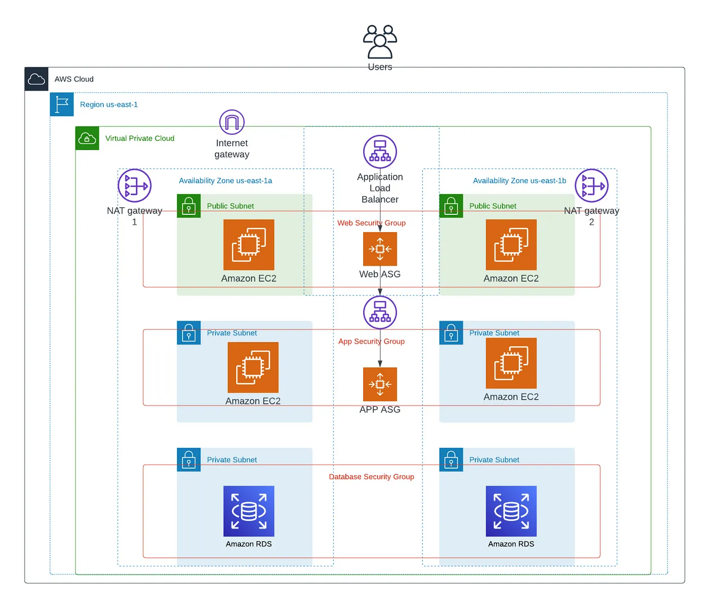

# Project3-3tire-architecture-with-terraform
Terraform + AWS and it's components

## Architecture Diagram that are going to create in this project

## Components of AWS being used
1.  =  1 VPC
2.  =   2 Public Subnets
3.  =   2 Private Subnets
4.  =   2 Autoscaling Groups
5.  =   2 Load Balancers (each one for public & private)
6.  =   2 Private EC2 Instances (according to our application layer)
7.  =   2 Public EC2 Instances (according to our presentation layer)
8.  =   2 NAT Gateways (so private instance can connect to the internet)
9.  =   2 Elastic IP addresses, one for each NAT gateway
10. =   1 Rds Instance